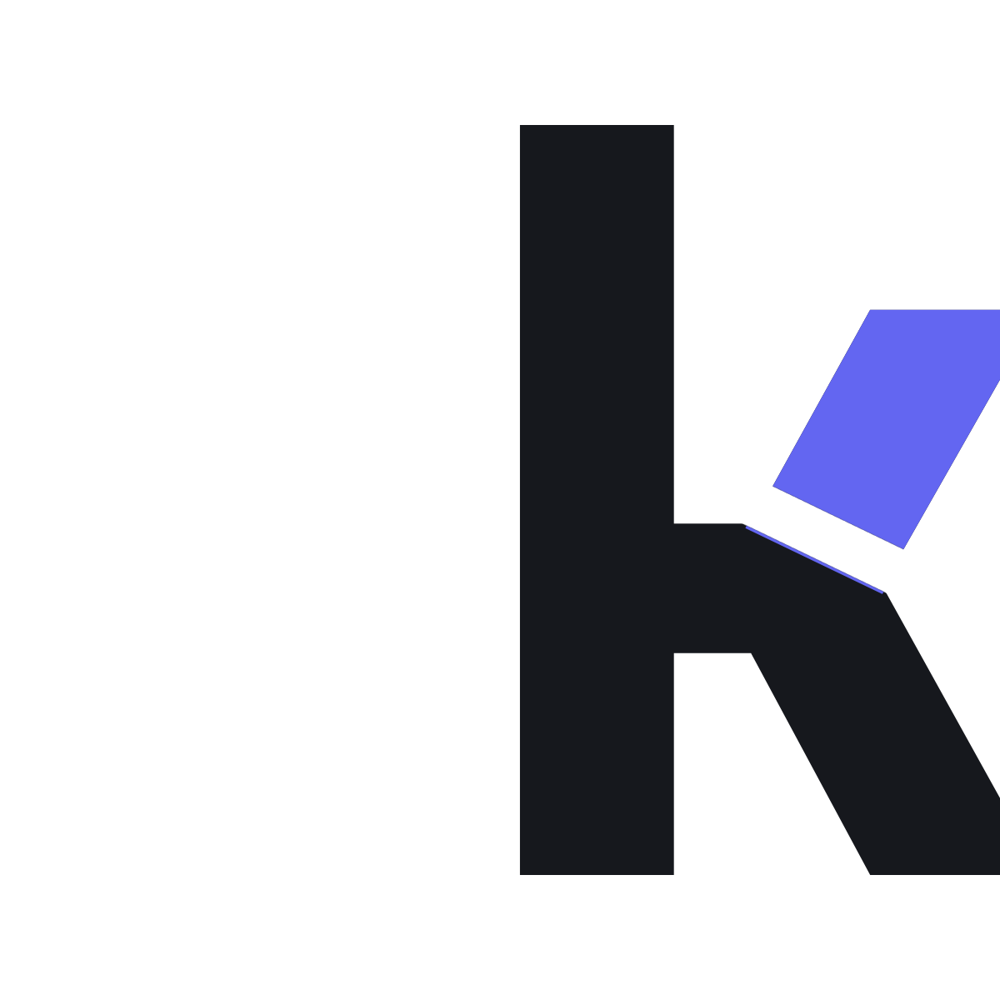

<div align="center">

<picture>
  <source media="(prefers-color-scheme: dark)" srcset="assets/logo-dark.png">
  
</picture>

# kitbag

**Everything this machine holds that is yours** — what it is, whose it is,
and how it gets onto the next machine.

[](https://github.com/Open330/kitbag/actions/workflows/ci.yml)
[](LICENSE)
[](https://www.rust-lang.org)
[](DESIGN.md)

English · [한국어](README.ko.md)


</div>

```console
$ kitbag status

  personal  (12)
  ├── = env:couchdb              COUCHDB_URI COUCHDB_DB COUCHDB_USER COUCHDB_PASSWORD
  ├── = ssh:id_ed25519           SHA256:XhCQXT9l7zas… (ED25519)
  └── + ssh:authorized_keys      5 keys: laptop desktop mini server phone

  shared · a friend  (4)
  └── = env:llm-proxy            PROXY_URL PROXY_TOKEN MODEL

  work · acme  (17)
  ├── ~ env:ci                   CI_TOKEN CI_URL DEPLOY_KEY_ID …  +5 more
  └── + file:aws-keychain        binary, 25788 bytes → ~/Library/Keychains/…

  mixed  (3)
  └── ? app:accounts             one bundle — personal, work

  + 3 new   ~ 1 changed   = 32 unchanged   ? 1 to build
```

> **Status: early, and working.** Every command below does what it says, against
> a real machine and a real store — `bw`, `op`, `pass` or an `age`-encrypted
> file. What is missing is the installer half: recipes cover packages, links,
> macOS defaults and commands, and the rest of a machine's setup is still
> ahead. See [DESIGN.md](DESIGN.md) for the argument and the plan.

## Start here

```bash
kitbag backup
```

One command, from a machine that has never done this to a machine whose state
is in a store. It asks which store, what this machine is willing to hold, and
then shows everything it found at once — a decision somebody makes by reading
down a list should be one answer, not one answer per line:

```console
  3/4  4 thing(s) here that nothing keeps.

     1  ~/.aws/credentials                     AWS access keys
        proposed as work
     2  ~/.config/gh/hosts.yml                 a GitHub token
        proposed as personal
     3  ~/.envs/*                              a directory of environment files
        needs its own `# scope:` line, or it is skipped
     4  ~/.ssh/id_*                            a private key, and this machine's own
        proposed as personal

       [all] · `none` · numbers like `1 3 5` or `2-4`
       `d 2` dismisses one for good, and asks again
       > 2-4

  4/4  What would be sent:

  + env:hf                        would be sent
  + ssh:id_ed25519@this-mac       would be sent
  + programs@this-mac             would be sent

  Send these? [y/N]
```

Empty means all of it, because the list was just read and the usual answer at
the end of reading it is yes; saying no takes a word. A number that is not in
the list is a question, not a selection — quietly taking the ones that did
exist is how somebody ends up believing they backed up something they did not.

Nothing is sent until that last question, and the line above it is the plan.
Every step is the command of the same name — `discover`, `track`, `push`,
`resolve` — so the walkthrough is an order to run them in, not a second
implementation to keep honest.

## The question nothing answers

Setting up a machine is two jobs handled by two kinds of tool. Dotfile managers
move your configuration. Password managers move your secrets. Neither can answer
the one that matters once you have more than one machine and more than one
employer:

> **What on this machine belongs to my company, and what happens to it when I
> leave?**

kitbag treats packages, configuration, system settings, credentials and app data
as the same kind of thing — a desired state, a source, a way to apply it, and an
**owner** — and filters every one of them through that owner.

| scope | meaning |
| :-- | :-- |
| `personal` | yours |
| `work` | an employer's or a client's |
| `shared` | an account someone else owns that you were given |
| `mixed` | one artifact holding several — it has to say which |
| `local` | this machine only, never leaves it |

A machine declares which scopes it takes. A personal laptop never restores work
credentials. A work machine does not install your personal toys. The same filter
decides what is sent, what is written, and what a report shows.

## Install

```bash
curl -LsSf https://raw.githubusercontent.com/Open330/kitbag/main/install.sh | sh
```

Detects the platform, checks the download against the checksums published with
it, and puts one binary in `~/.local/bin`. Or `cargo install --path crates/kitbag-cli`.

## Commands

```console
kitbag status                 what this machine has, marked against the store
kitbag plan                   what apply would change, and nothing else
kitbag apply                  make the machine match the recipes
                              (packages, links, defaults, downloads, clones, merges)
kitbag discover               find state nothing is tracking, and what is
                              tracked and not in the store
kitbag add <path>...          start keeping it
kitbag tracked                what this machine was told to keep, as it was told
kitbag programs               write down what is installed, so it can be again
kitbag push / restore         move it, one scope at a time
kitbag diff                   what differs, without the values
kitbag resolve                settle what neither side can settle alone
kitbag doctor                 permissions, reachability, unscoped files, orphans
kitbag lint                   refuse the things that must not be committed
kitbag trust sync             the machines that may log in here
kitbag completions zsh        …bash, fish, elvish, powershell
```

`--json` on everything, `--color auto|always|never`, `NO_COLOR` respected, and
no command ever prints a secret's value.

## When two machines disagree

A difference has a direction, because kitbag records the fingerprint at the
last exchange — the third point git calls a merge base:

```console
>  this machine moved, the store did not     push sends it
<  the store moved, this machine did not     restore takes it
!  both moved since they agreed              yours to settle
```

A push will not send a `<` and a restore will not take a `>`; both are an
older copy written over a newer one. A `!` stops both and waits:

```console
$ kitbag resolve
! env:docs-publish  (1/2)
    here   3 lines
    store  5 lines
    only there:  DOCS_ROOT DOCS_USER
    differ:      DOCS_URL
    [m]ine  [t]heirs  [s]kip  [q]uit >
```

Key names, counts, sizes and file lists inside an archive — never a value
from either side. An answer that is not understood is a skip, and so is an
empty line: one of the two real answers writes over a credential, so the key
easiest to hit by accident does nothing. With no terminal it asks nothing and
lists what is left.

## Things that belong to one machine

Four machines can derive one item name from one path and hold four different
things under it. An SSH key is the example that matters: two machines sharing
one means revoking it locks out both.

```toml
[[track]]
path = "~/.ssh/id_ed25519"
per_machine = true          # ssh:id_ed25519@<host>
```

Four items, four keys, each one kept — and the file stays at
`~/.ssh/id_ed25519`, where ssh looks for it. Only the name in the store
differs, and a restore leaves alone anything stamped with another machine's.

`skip` is the other answer, for an item this machine wants nothing to do with
in either direction. Not for one that simply belongs to it: refusing to
exchange a key is refusing to back it up, and a key that exists in one place
is gone with the machine it is on.

## Not only secrets

A machine that came back with every credential intact and no shell profile is
a machine somebody still has to spend an evening on. `discover` and `backup`
look for both, and say which is which:

```console
  credentials and keys
     1  ~/.aws/credentials                     AWS access keys
     2  ~/.ssh/id_*                            a private key, and this machine's own

  setup — configuration and scripts
     3  ~/.config/nvim/*                       your editor's own configuration
     4  ~/.local/bin/*                         scripts you wrote (installed binaries are left out)
     5  ~/.zshrc                               your shell, as you set it up
```

**A `bin` directory holds two different things.** What somebody wrote, and what
a package manager installed. Only the first belongs in a store: the second is a
binary built for one architecture, which is exactly what the `programs` list
exists to carry as a name instead. `only = "scripts"` takes the files that
begin `#!` and leaves the rest — cheaper and more honest than guessing from an
extension most scripts do not have, or from the executable bit every installed
binary also has.

```toml
[[track]]
path = "~/.local/bin/*"
scope = "personal"
only = "scripts"
```

A filter this version does not know takes **nothing** and says so. Taking
everything instead would quietly send what somebody asked to have filtered out.

**And whatever a git repository already holds is named, not proposed.** A
settings repository symlinks `~/.zshrc` into itself; a second keeper for it is
duplication, and going quiet about it reads as a bug:

```console
  14 already kept by a git repository, so not proposed:
    ~/.zshrc                               ~/workspace/settings
    ~/.local/bin/mkln                      ~/workspace/settings
  Whatever keeps that repository keeps these.
```

Asked of every file a pattern matches, not of the first one: a directory where
one script is a link into a repository and the next is not is the ordinary
case.

## Keeping something is one command

```console
$ kitbag add ~/work/deploy --scope work

  + ~/work/deploy/*                        work · scripts only — 2 of 4 here are not

  Added to ~/.config/kitbag/machine.toml.
  `kitbag status` shows it; `kitbag push` sends it.
```

The config file exists so a machine can remember the answer, not because
anybody should have to type it in that shape. What `add` works out rather than
asking — and prints, so none of it is silent:

- **A directory becomes a pattern.** `~/work/deploy` is a standing answer, not
  a list of today's files, so it is written `~/work/deploy/*` and covers what
  is not there yet.
- **A directory of scripts *and* installed binaries takes the scripts.** That
  is the `only = "scripts"` rule, applied where it applies. `--all` overrides it.
- **A file carrying its own `# scope:` marker gets no second answer.** The
  marker travels with the file; a scope in the config as well is another answer
  to the same question, and the two can disagree.
- **Adding the same thing twice adds it once.**

`--everywhere` writes the catalogue rule as well, so every machine looks there:

```bash
kitbag add ~/work/deploy --scope work --everywhere --why "deploy scripts"
```

### Where it shows up

Three questions, three commands, and they are not the same question:

```console
$ kitbag tracked        # what this machine was told to keep, as it was told

    ~/work/deploy/*      work · scripts only                3 file(s), 1 filtered out
    ~/notes/journal.md   scope from each file's own marker  1 file(s)
    ~/.npmrc             personal                           nothing here

$ kitbag status         # the items those come to, marked against the store
$ kitbag catalogue      # the rules about where to look, built in and yours
```

The split is narrower than it looks. `status` is the one to reach for: it
already names a tracked path with no file behind it, and it counts what a
filter left out. `tracked` is the config read back as it was written — one
line per track rather than per file, which is the difference between three
lines and thirty-five on a machine with `~/.envs/*.env` in it.

`catalogue` is the one that is genuinely a different question: it is about
where to look for what you do **not** keep yet.

## The catalogue is a list you can add to

`kitbag catalogue` says what `discover` looks for and where to add to it.

The built-in list is the places that are the same on most machines. Nobody else
knows where you keep your work, so the list is open:

```toml
# ~/.config/kitbag/catalogue.toml

[[known]]
path = "work/deploy/*"          # under your home
why  = "deploy scripts"
scope = "work"                  # personal by default
kind  = "setup"                 # or "secret"; setup by default
only  = "scripts"               # optional: files beginning `#!`
```

A path already in the built-in list **replaces** that entry rather than adding
a second one, which is how somebody says "AWS is `personal` on this machine"
without having to argue with a Rust constant:

```console
$ kitbag catalogue
  credentials and keys · yours
    ~/.aws/credentials                     personal               my own AWS keys

  setup — configuration and scripts · yours
    ~/work/deploy/*                        work, only scripts     deploy scripts

  34 place(s) looked for.
```

Two refusals on purpose. A file that will not parse is **reported**, and the
built-in list stays in use — a catalogue silently doing nothing is how somebody
comes to believe they are watching a path they are not. And a misspelt key is
an error rather than a shrug: `scopes` is not `scope`, and ignoring it leaves a
rule doing something other than what is written in front of you.

## Programs, as a list

A store should never hold a binary. It is large, it is built for one
architecture, and whoever published it will hand it over again. What is worth
keeping is what was installed:

```console
$ kitbag programs
kitbag/programs 1
brew	ripgrep
cask	ghostty
cargo	kitbag	0.13.0
npm	@bitwarden/cli	2026.8.0
rustup	stable-aarch64-apple-darwin
```

Seventy-one of those is a kilobyte. Put it back with `kitbag programs
--restore`, which installs what is missing and removes nothing — a machine is
allowed to have more than the list; the list is what it must not lack. A
manager it cannot drive is named rather than guessed at.

Which is fine until the thing you need was never in a manager. `rustup`, `uv`,
`nvm`, and every `curl … | sh` in somebody's setup script are the fifth of a
machine no package list will ever describe, and a list that omits the
toolchain is not one you can rebuild from. So a machine may declare them:

```toml
[[program]]
name = "uv"
install = "curl -LsSf https://astral.sh/uv/install.sh | sh"
version_from = "uv --version"     # optional; the version is read from its output
present = "uv --version"          # optional; defaults to `command -v uv`
```

It is written out only if it is actually there — a declaration nobody has acted
on is a plan, not a fact — and the line travels with the list, so the machine
being rebuilt learns how to install it from the store rather than from a config
it does not have yet. kitbag prints that line before running it, because a
command out of a store is still a command out of a store.

The other machines' lists are readable too, which is the point when the machine
you want to copy is the one that died:

```console
$ kitbag programs --list
jiun-mbp                     programs@jiun-mbp
june-mbp                     programs@june-mbp

$ kitbag programs --from jiun-mbp              # read it
$ kitbag programs --from jiun-mbp --restore    # or become it
```

As a tracked item it is a command pair like any other:

```toml
[[track]]
name = "programs"
scope = "personal"
per_machine = true
command = { export = "kitbag programs", restore = "kitbag programs --restore" }
```

Which is also why `kitbag restore` asks before it writes. Restoring files is
recoverable — each one is backed up first. Installing software is not, so the
whole command stops and asks once; `-y` answers in advance, and `--dry-run`
says exactly what would happen and writes nothing.

## Three stores, and why

A public dotfiles repository is safe only if it leaves out **the list of what
exists**. `~/.envs/kibana.env → work` names an employer, a stack and a target,
and nobody needs the secret to make use of that.

```
  repo (public)        recipes and providers — no employer, no service name
  inventory (private)  what exists, where it goes, which scope — in the store
  secret store         the values — a vault, or an encrypted file
```

Collection is by pattern, never by name. Scope is a marker the file carries
(`# scope: work`), not a table in the repo. `kitbag lint` fails a commit that
breaks either rule — and runs over [this repository](CONTRIBUTING.md) on every
CI run, because a tool that leaked its own author's machine would have argued
against its design.

## Secret stores

kitbag does not implement one. It borrows yours, so that losing interest in
kitbag never strands your secrets inside it.

| backend | store | |
| :-- | :-- | :-- |
| `bw` | Bitwarden / Vaultwarden — free tier, self-hostable | v0.1 |
| `op` | 1Password — the best developer CLI in the category | v0.1 |
| `pass` | `pass` / `gopass` — GPG and a git repo | v0.2 |
| `age` | an `age`-encrypted file — no server at all | v0.2 |

Adding one is a `list`/`get`/`put` adapter. Everything kitbag needs to know
about an item travels inside its own envelope, so a store that can keep bytes
under a name is enough:

```text
kitbag/1
scope: work
owner: acme
encoding: utf8
sha256: 1f0e3d…

export TOKEN=…
```

<details>
<summary>Why there is no <code>delete</code> in the backend trait</summary>

A store holds things your machine knows nothing about — another machine's key,
an account someone else added. A tool that removes what it does not recognise
eventually removes something that mattered. Removal is a person's decision,
taken with the store's own client.

</details>

## Prior art

[chezmoi](https://www.chezmoi.io/) is the mature tool in this space and does
more than this one: templates for per-machine differences, full-file
encryption with age or gpg, seventeen password-manager integrations, scripts,
declarative package installation, and Windows. If you want your dotfiles on
several machines, use chezmoi. Its source of truth is a git repository, which
means two machines that both changed a file get a real merge and both versions
survive — something a key-value store cannot offer, and the clearest thing
kitbag gives up.

What chezmoi does not have is an **owner**. Its axis of variation is *which
machine*; kitbag's is *whose*. "What on this machine belongs to my employer,
and what happens to it when I leave" is not a question templates answer, and
it is the only reason this exists.

[yadm](https://yadm.io/) is git over `$HOME` and shares chezmoi's shape.
[1Password CLI](https://developer.1password.com/docs/cli/) and
[SOPS](https://github.com/getsops/sops) manage secrets and not the machine.
[Mackup](https://github.com/lra/mackup) moved app state and is unmaintained.

## Building

```bash
cargo test --workspace
cargo clippy --workspace --all-targets -- -D warnings
```

Contributions welcome — read [CONTRIBUTING.md](CONTRIBUTING.md) first; the first
rule is that nobody's machine goes in this repository.

<div align="center"><sub>MIT · <a href="DESIGN.md">DESIGN.md</a></sub></div>
